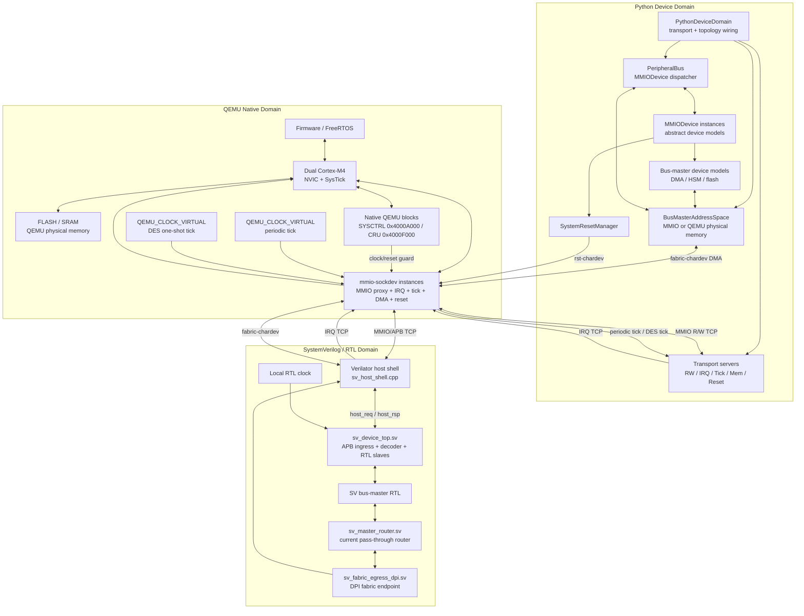

# QEMU Custom MMIO Socket Device

A framework for implementing custom ARM hardware devices in QEMU, with register logic and interrupt firing modelled in external processes. A single generic QEMU SysBus device (`mmio-sockdev`) proxies MMIO reads/writes, IRQ lines, virtual-clock ticks, and bus-master DMA to/from Python or SystemVerilog/Verilator device models over TCP.

This repository is a **chip-function validation environment**, not a full cross-domain cycle-accurate simulator. QEMU provides a CPU/software behavioural model for firmware execution. Python devices provide fast functional peripheral models. SystemVerilog devices keep their own local RTL clock and are connected to QEMU through transaction boundaries such as MMIO reads/writes and IRQs.

For QEMU and Python timed devices, time is **chip virtual time**, not wall-clock time. QEMU is run with `-icount shift=5` so `QEMU_CLOCK_VIRTUAL = instruction_count × 32 ns` — matching the KX6625 at 48 MHz / CPI≈2. A WDT set to 100 ms means 100 ms of simulated chip time, independent of how long the host machine takes to emulate it. SystemVerilog devices are intentionally modelled as independent clock domains; their local pclk/cycle count is not automatically back-annotated into QEMU CPU cycles.

## Validation Scope

This environment has two primary goals:

1. **Fast software prototyping**: develop and debug firmware, drivers, RTOS integration, and application logic against a realistic SoC memory map and interrupt topology before hardware is available.
2. **Fast RTL device validation**: connect selected SystemVerilog peripherals to firmware running on QEMU, exercise their register-level behaviour and IRQ paths, and compare them against Python reference models when useful.

The intended abstraction boundary is:

| Domain | Role | Time/clock model |
|--------|------|------------------|
| QEMU CPU/SoC | Behavioural CPU, NVIC, memory map, firmware execution | QEMU virtual time with optional `icount`; MMIO callbacks are synchronous from the guest CPU's perspective |
| Python devices | Fast functional models and reference/checker models | Can use QEMU virtual-time ticks/DES for deterministic device events |
| SystemVerilog devices | RTL device models with local state machines and registers | Independent local clock maintained by the SV host shell; no claim of cycle-accurate CPU/APB alignment |

MMIO access to an SV device is a synchronous transaction boundary: QEMU blocks while the bridge completes the APB/RTL operation, then the guest continues. The elapsed host time and the number of SV pclk cycles consumed by that transaction do not automatically advance QEMU guest cycles. This makes the environment well suited for software bring-up and device functional validation, while keeping the boundary honest about what is not modelled: CPU bus wait-state timing and exact 48 MHz : 16 MHz cross-domain cycle alignment.

## Overview

This project implements:
- **Custom QEMU Device** (`mmio-sockdev`): Generic SysBus proxy — 4 KB MMIO, IRQ line, optional virtual-clock tick channel, optional bus-master DMA memory channel, optional system-reset channel (`rst-chardev`). One instance per device on the QEMU command line.
- **Python Device Domain** (`device_model/soc_top.py`): `PythonDeviceDomain` wires transport servers, the `PeripheralBus`, `BusMasterAddressSpace`, reset/tick managers, and abstract `MMIODevice` instances. `SoCTop` remains as a compatibility alias. `kx6625_default()` returns the canonical KX6625 device-domain map.
- **Transport Boundary** (`device_model/mmio_device_server.py`): TCP servers for `mmio-sockdev` channels — R/W, IRQ, periodic/DES tick, bus-master memory, and reset. Each peripheral model is a `MMIODevice` subclass with `read()`, `write()`, and optional `on_tick()`.
- **Native SYSCTRL block**: QEMU-native system controller at `0x4000A000` for CPU identity, CPU1 reset release, boot status, device clock/reset policy state, and SYSCTRL-mediated indirect device-register access.
- **Nine socket-backed peripherals**: Console UART, multi-channel DMA controller, countdown timer, DMA client demo peripheral, CRC-32 hardware accelerator, Watchdog Timer (WDT), SystemVerilog APB timer/DMA subsystem, an HSM crypto accelerator with AES-128/CMAC support, and an OTP controller with 1-to-0 programming and ECC. See [`spec/README.md`](spec/README.md) for register maps.
- **SystemVerilog Device Prototype** (`sv_device/`): A Verilator-built APB peripheral subsystem listening on TCP ports 7906/7907/7912. QEMU drives it through a normal `mmio-sockdev` instance at `0x4000B000`; the SV subsystem contains an APB timer at offset `0x000` and a first-version SV DMA at offset `0x100`, with completion IRQs returned through NVIC IRQ5.
- **KX6625 Custom SoC** (`scripts/qemu-fork/hw/arm/kx6625.c`): Dual Cortex-M4 @ 48 MHz, 512 KB FLASH @ `0x00000000`, 128 KB SRAM @ `0x20000000`, NVIC with 16 external IRQs per ARMv7-M container.
- **FreeRTOS Cortex-M4F Firmware**: CPU0 boots FreeRTOS using the official GCC `ARM_CM4F` port and Cortex-M SysTick; CPU1 runs a lightweight bare-metal IPC loop. The demo task exercises UART, DMA M2M, DMA peripheral DREQ/DACK, CRC-32, dual-core IPC, SV timer IRQ, SV DMA M2M copy, OTP programming/read protection, HSM AES-CBC/CMAC including OTP-backed `KEY_ID`, SYSCTRL, and WDT countdown-reset warm-boot detection.
- **End-to-End Smoke Test** (`scripts/e2e_test.sh`): Starts Python server and the SV host shell, boots QEMU with `icount shift=5`, exercises all devices including SV timer/DMA, OTP/HSM direct key wiring, HSM crypto, SYSCTRL indirect register access, and a WDT-triggered system reset, asserts firmware output, and generates an HTML trace report.
- **Event Tracer** (`device_model/tracer.py`): Non-blocking JSONL event trace for every device — records virtual time, wall time, and device-specific fields. Written by a background thread so device models never block on I/O. Visualised as a self-contained HTML report (`build/trace_report.html`) by `scripts/visualize_trace.py`.

## Architecture

### System Overview



The standalone source for this diagram is kept in [`doc/architecture_diagram.md`](doc/architecture_diagram.md).

### Virtual-Clock Tick Broadcast

The `tick-chardev` property on `mmio-sockdev` connects to a `QEMUTimer` on `QEMU_CLOCK_VIRTUAL`. Every `tick-period-ms` of **simulated** time QEMU sends:

```
'T'(1B) | vtime_ns(8B LE)
```

`TickServer` receives this and calls `bus.tick_all(vtime_ns)` — dispatching to **every** registered device. Devices that need timing override `on_tick()`; the rest inherit a no-op. This architecture means:

- Adding a new timed device requires no changes to the transport layer.
- Ticks stop when QEMU is paused (gdb, single-step) — no spurious IRQs.
- The same tick stream drives both the timer countdown and DMA latency.

```
QEMU_CLOCK_VIRTUAL
    │  'T'|vtime_ns  (TCP :7896)
    ▼
TickServer  ──► bus.tick_all(vtime_ns)
                   ├── ConsoleUartDevice.on_tick()   →  no-op (inherited)
                   ├── DmaController.on_tick()       →  execute BUSY-channel transfers at deadline
                   ├── TimerDevice.on_tick()         →  check elapsed_ns ≥ load_ns; IRQ on expiry
                   ├── DmaClientDemoDevice.on_tick() →  no-op (inherited)
                   ├── CrcDevice.on_tick()           →  no-op (inherited)
                   └── WdtDevice.on_tick()           →  check elapsed_ms ≥ load_ms; trigger reset on expiry
```

### Simulation Time Model

QEMU is started with `-icount shift=5,sleep=off,align=off`:

```
QEMU_CLOCK_VIRTUAL = executed_instruction_count × 32 ns
```

This matches the KX6625 at 48 MHz with CPI ≈ 2 (1 instruction ≈ 41.6 ns real; 32 ns virtual gives ~23% speedup, well within functional accuracy bounds).

**Key properties:**

| Property | Behaviour |
|----------|-----------|
| WDT 100 ms timeout | Fires after firmware executes ~3.1 M instructions — **chip time, not wall time** |
| `WFI` instruction | CPU halts; QEMU jumps vtime directly to the next `timer_mod` deadline — zero host wait |
| MMIO R/W TCP latency | Host TCP round-trip (~50 µs real) counts as **0 ns virtual time** — bus accesses are instantaneous from the chip's perspective |
| DMA 512 ns latency | `timer_mod(vtime + 512)` fires after exactly 16 virtual instructions — QEMU wakes from WFI immediately |
| Debug pause (gdb) | `QEMU_CLOCK_VIRTUAL` freezes — no spurious timer fires, no tick messages |

**Running with icount (recommended):**
```bash
ICOUNT_SHIFT=5 bash scripts/e2e_test.sh      # tests + HTML trace report
ICOUNT_SHIFT=5 bash scripts/run_interactive.sh
```

Without `ICOUNT_SHIFT`, QEMU falls back to realtime wall-clock mode (functional but non-deterministic).

### FreeRTOS and Dual-Core Model

KX6625 is configured as a dual Cortex-M4 SoC. Both cores are instantiated by QEMU as ARMv7-M containers using the generated `KX6625_CPU_TYPE_STR` from `spec/soc.yaml`.

The firmware uses an asymmetric boot model:

- **CPU0** runs the KX6625 startup code, initialises `.data`/`.bss`, creates the `app_task`, and starts the FreeRTOS scheduler with `vTaskStartScheduler()`.
- **CPU1** is held in reset until CPU0 writes `SYSCTRL.CPU1RST`; it then switches to its own stack and runs `cpu1_main()`, a bare-metal shared-SRAM IPC polling loop.
- This is not SMP FreeRTOS. FreeRTOS scheduling is active on CPU0 only.

The FreeRTOS port is the official GCC Cortex-M4F port:

```
freertos/FreeRTOS-Kernel/portable/GCC/ARM_CM4F/port.c
```

The scheduler tick uses the Cortex-M architecture **SysTick** exception, not the KX6625 `timer0` peripheral. `timer0` remains an external IRQ2 device available to firmware and tests. The vector table in `firmware/start.S` routes the core scheduling exceptions directly to the FreeRTOS port:

```
SVCall  -> vPortSVCHandler
PendSV  -> xPortPendSVHandler
SysTick -> xPortSysTickHandler
```

### DES (Discrete Event Simulation) Protocol

Timed devices use the DES write-response protocol to schedule their next event with nanosecond precision in virtual time, without requiring a periodic tick:

```
Firmware writes register (e.g. DMA_CTRL.START):
  QEMU → Python: 'W' | offset(4B) | size(1B) | data(sizeB)
  Python computes transfer latency (e.g. 512 ns)
  Python → QEMU: next_event_ns(8B LE)   ← non-zero = schedule tick
  QEMU: timer_mod(vtime_now + next_event_ns)
  Firmware executes WFI
  icount: vtime jumps to deadline
  QEMU fires tick → Python on_tick(vtime_ns)
  Python executes DMA transfer, asserts IRQ
  Firmware wakes from WFI, runs ISR
```

Devices that have no timing response return `0` from `write()` (no tick scheduled). The DMA controller (port 7905) and Timer (embedded in the 1 ms periodic stream) both use this mechanism.

```
DMA DES tick channel (port 7905) — one-shot, fires at arm_vtime + transfer_ns:

  write(CTRL.START) → returns 512 → timer_mod(now+512)
       │
       └── WFI ─── vtime jumps 512 ns ──► on_tick(now+512)
                                              └── DMA copy + IRQ
```

### IRQ Flow

```
MMIODevice.irq_controller.set_irq(idx, level)
    │  'I'(1B) | idx(1B) | level(1B)  (TCP irq-port)
    ▼
mmio-sockdev (QEMU)  ──►  NVIC (IRQ line)  ──►  Cortex-M4
```

NVIC pulse pattern: assert then immediately deassert so the NVIC edge-trigger does not re-fire.

### Bus-Master Fabric Flow

DMA-capable models act as bus masters: they read and write platform addresses
without involving the firmware CPU. This is modelled through the shared
`fabric-chardev` transaction channel:

```
FabricChannel.read(master_id, address, length)
    │  'F'|'R'|master_id|flags|address|length  → QEMU fabric
    │  status|data(length)                      ← QEMU fabric
    ▼
FabricChannel.write(master_id, address, data)
    │  'F'|'W'|master_id|flags|address|length|data  → QEMU fabric
    │  status                                      ← QEMU fabric
```

The same fabric frame is used by Python masters, SV masters, and native QEMU
masters. Status codes let device models distinguish a successful bus write from
simulated bus faults, protection failures, or unmapped-address responses without
changing the packet framing again.

### SystemVerilog APB Peripheral Subsystem

`sv_device/sv_device_top.sv` is the Verilated top for the SV prototype region at `0x4000B000`. It composes APB ingress, an APB decoder, APB timer, split DMA register/core blocks, and an outbound fabric endpoint:

| Module | Responsibility |
|--------|----------------|
| `sv_apb_decoder` | Decode QEMU-visible APB register windows and mux APB responses |
| `sv_apb_ingress` | Convert host shell requests into APB setup/access cycles |
| `sv_timer_apb` | APB timer smoke test and IRQ generation at offset `0x000`-`0x0ff` |
| `sv_dma_regs` | DMA APB register file, start/clear pulses, and status presentation |
| `sv_dma_core` | DMA transfer state machine using a generic master request/response interface |
| `sv_master_router` | Route SV master transactions; first version forwards all requests to the external fabric endpoint, later can target local APB/FIFO windows |
| `sv_fabric_egress_dpi` | Keep SV master response timing in SV and call C++ DPI helpers at the fabric boundary |

The public APB register map remains:

| Offset window | Device | Purpose |
|---------------|--------|---------|
| `0x000`-`0x0ff` | `sv_timer_apb` | APB timer smoke test and IRQ generation |
| `0x100`-`0x1ff` | `sv_dma_apb` | First-version 32-bit aligned M2M DMA prototype |

The SV DMA keeps its own local RTL clock inside `sv_host_shell.cpp`. Firmware configures the DMA through MMIO/APB registers; `sv_apb_ingress.sv` performs the APB setup/access cycles inside SV, and the host shell returns the MMIO response once SV produces `host_rsp`. When the DMA needs memory access, `sv_dma_core.sv` sends a generic master transaction through `sv_master_router.sv` into `sv_fabric_egress_dpi.sv`, which calls the host shell's timing-independent DPI helpers to emit `fabric-chardev` reads/writes into QEMU fabric. Completion is signalled by the shared SV IRQ line through NVIC IRQ5.

### DMA Controller Architecture

`DmaController` (`dma_controller.py`) is the single MMIO-mapped DMA IP. It supports two independent channels:

| Channel | Mode | How triggered | Completion |
|---------|------|--------------|------------|
| CH0 | Memory-to-memory (M2M) or M2P | Firmware writes `CH0_CTRL.START` | Pulses DMA IRQ (NVIC) |
| CH1 | Peripheral DREQ/DACK (M2M/P2M/M2P) | `DmaClientHandle.transfer()` call | Calls peripheral's `on_complete` callback |

**Firmware path (CH0) — DES scheduling:**

```
write(CH0_CTRL.START)
  → _firmware_start()                  → returns transfer_ns (e.g. 512)
  → QEMU timer_mod(vtime + 512 ns)
  → firmware executes WFI
  → icount: vtime jumps to deadline
  → on_tick(vtime_now + 512 ns)        → MemChannel copy → pulse IRQ 1
```

No background thread is needed. The virtual-time deadline is guaranteed by icount — the transfer completes at exactly `arm_vtime + transfer_ns` in chip time.

**Peripheral path (CH1) — background thread (cross-device scheduling):**

```
DmaClientHandle.transfer()  →  _peripheral_request()  →  _arm_channel()
  → background thread waits for DREQ acknowledgment
  → _tick_channel() after N ticks → MemChannel copy → on_complete() callback
  → DmaClientDemoDevice sets STATUS.DONE → pulses IRQ 3
```

## Device Model Layer

`device_model/mmio_base.py` provides the shared building blocks used by every Python device model. These helpers eliminate per-device boilerplate and encode common hardware access patterns as reusable, testable units.

### `UartChannel` — Firmware UART Terminal Server

A TCP server that forwards the firmware UART byte stream to external terminal clients. It multiplexes over any number of simultaneously connected clients and handles disconnection transparently.

```
ConsoleUartDevice.write(TXDATA)
     │ raw byte (LF → CRLF for terminal)
     ▼
UartChannel.send(data)          — called in device R/W thread
     ├──► client socket 1  (e.g. nc 127.0.0.1 7904)
     └──► client socket 2  (e.g. python3 scripts/uart_console.py)
```

`UartChannel` is transport-layer infrastructure (like `IRQController`, `MemChannel`, `RstController`), not a device model. It lives in `mmio_base.py` and is wired by `PythonDeviceDomain` (via `UartCfg.term_port`). You can also wire it manually:

```python
uart_channel = UartChannel(port=7904)
uart_channel.start()    # starts daemon accept thread; non-blocking
uart_dev = ConsoleUartDevice(..., uart_channel=uart_channel)
```

| Method | Description |
|--------|-------------|
| `start()` | Bind port, start accept-loop daemon thread |
| `stop()` | Close server socket |
| `send(data: bytes)` | Broadcast to all connected clients; removes dead connections |
| `connected` | `True` if at least one client is connected |

The `send()` call is fire-and-forget with non-blocking `sendall` — a slow or disconnected client never blocks the device model thread.

### `RegisterBank` — Thread-Safe Register Storage

Replaces the raw `bytearray + threading.Lock + manual bounds-check` pattern that every device would otherwise repeat.

```python
self._regs = RegisterBank(
    size,
    initial=bytes(init_values),          # optional reset snapshot
    policies={                            # optional per-register access policies
        _STATUS:  RegAccess.READ_ONLY,
        _VALUE:   RegAccess.READ_ONLY,
        _INTCLR:  RegAccess.WRITE_ONLY,
    },
)
```

**Key methods:**

| Method | Description |
|--------|-------------|
| `read(offset, size) → bytes` | CPU-side read; applies access policy |
| `write(offset, size, data)` | CPU-side write; applies access policy |
| `get32(offset) → int` | 32-bit LE read, **bypasses policy** (device-internal) |
| `set32(offset, value)` | 32-bit LE write, bypasses policy |
| `set_bits(offset, mask)` | Atomic OR, bypasses policy |
| `clear_bits(offset, mask)` | Atomic AND-NOT, bypasses policy |
| `reset(initial=None)` | Restore to construction-time snapshot |
| `with self._regs:` | Acquire internal lock for atomic multi-register operations |
| `get32_nolock / set32_nolock` | No-lock variants for use inside the context manager |
| `self._regs[byte_offset]` | Direct byte access inside context manager |

### `RegAccess` — Per-Register Access Policies

`RegAccess` is an `enum.Flag` whose members describe how a register behaves when the CPU reads or writes it. Policies apply **only to the external CPU path** (`read()`/`write()`). Internal device helpers (`get32`, `set_bits`, `__setitem__`, etc.) always bypass policies so the device hardware can freely update its own state.

| Flag | CPU Read | CPU Write | Typical Use |
|------|----------|-----------|-------------|
| *(none)* | returns stored value | stores value | normal R/W register |
| `WRITE_ONLY` | returns **0** | stores normally | pulse/strobe registers (`INTCLR`, `KICK`, `SWRESET`) |
| `READ_ONLY` | returns stored value | **dropped silently** | `STATUS`, `VALUE`, hardware-computed registers |
| `READ_CLEAR` | returns value then **clears to 0** | stores normally | latching event / error registers |
| `W1C` | returns stored value | **bits written 1 → cleared** | IRQ status (ARM convention): firmware acks by writing bit mask |
| `W1S` | returns stored value | **bits written 1 → set** | set-only enable registers |

Flags can be combined with `|`.

```python
# Example: standard ARM interrupt status register
policies={
    _STATUS: RegAccess.W1C,        # firmware clears individual IRQ bits
    _INTCLR: RegAccess.WRITE_ONLY, # reads return 0
    _VALUE:  RegAccess.READ_ONLY,  # hardware-computed; CPU writes dropped
}

# Example: self-clearing event latch
policies={
    _EVENTS: RegAccess.READ_CLEAR, # read returns accumulated flags and zeroes the register
}
```

### `IrqLine` — Single Interrupt Line

Encapsulates an `IRQController` + line index and provides named operations matching Cortex-M NVIC semantics.

```python
self._irq = IrqLine(irq_controller, idx=0)

self._irq.assert_()    # level = 1  (stays high; use for level-triggered, e.g. timer)
self._irq.deassert()   # level = 0
self._irq.pulse()      # assert then immediately deassert (edge-trigger; NVIC won't re-fire)
self._irq.wait_connected(timeout)  # block until QEMU IRQ channel connects
self._irq.idx          # read-only: line index
```

`pulse()` is the correct primitive for most peripherals — the NVIC latches the rising edge as *pending*; the level must return low before the handler returns to prevent the NVIC re-pending the interrupt on exception return.

If `irq_controller` is `None` all methods are silent no-ops, so devices remain constructible without an IRQ channel.

### `VirtualClock` — Countdown Tracker

Encapsulates the `_start_vtime_ns / _last_vtime_ns` countdown pattern shared by the Timer and WDT.

```python
self._clock = VirtualClock()

# In on_tick():
self._clock.update(vtime_ns)                # record latest timestamp
if self._clock.is_expired(load_ms):
    self._clock.disarm()                    # one-shot
    # or:
    self._clock.rearm_periodic(load_ms * 1_000_000)  # periodic — advances start by one period (no drift)

# Arm (e.g. when CTRL.ENABLE written):
self._clock.arm()                # from most-recent tick
self._clock.arm(vtime_ns)        # from explicit timestamp

# Read remaining time:
remaining = self._clock.remaining_ms(load_ms)
```

The clock is correct across QEMU debug pauses: virtual time stops, `update()` stops being called, `is_expired()` stays False.

### `DeviceTracer` — Per-Device Event Trace Handle

`device_model/tracer.py` provides lightweight, non-blocking event tracing for every Python device model. Records are written in **JSONL** format (one JSON object per line) by a background thread, so the device R/W and tick threads never block on file I/O.

```python
from device_model.tracer import Tracer, NULL_DEVICE_TRACER

# In mmio_device_server.py main():
tracer = Tracer('build/device_trace.jsonl')   # starts background writer thread

# Each device gets a bound handle:
self._tr = tracer.context(self.name)          # DeviceTracer

# In on_tick() — update virtual-time context (call first):
def on_tick(self, vtime_ns: int) -> None:
    self._tr.tick(vtime_ns)                   # updates _vtime_ns context
    ...

# Anywhere in the device — emit an event:
self._tr.emit('EXPIRE', load_ms=100)          # always non-blocking
self._tr.emit('TX', ch=65, ascii='A')
```

**JSONL record format** (flat, compact, deterministic field order):

```json
{"seq":362,"t_wall_ns":1714400362000000000,"t_virt_ns":2007975928,"dev":"DmaController(2ch)","event":"CH_DONE","ch":0,"ok":true}
{"seq":671,"t_wall_ns":1714400362050000000,"t_virt_ns":0,"dev":"CRC-32","event":"RESULT","crc32":"0xcbf43926"}
{"seq":1219,"t_wall_ns":1714400362100000000,"t_virt_ns":2346054174,"dev":"wdt","event":"TIMEOUT","timeout_cnt":1}
```

The first record in every trace file is a `HEADER` sentinel:

```json
{"seq":0,"t_wall_ns":..."dev":"__tracer__","event":"HEADER","version":"1","pid":12345,"path":"build/device_trace.jsonl"}
```

**Events emitted per device:**

| Device | Events |
|--------|--------|
| `ConsoleUart` | `TX` (ch, ascii), `IRQ_FIRE` (irq_idx), `RESET` |
| `TimerDevice` | `ARM` (load_ms), `DISARM`, `EXPIRE` (load_ms), `IRQ_ASSERT` (irq_idx), `INTCLR` (irq_idx), `RESET` |
| `WdtDevice` | `LOAD` (load_ms), `ARM` (load_ms), `DISARM`, `KICK`, `IRQ_PULSE` (irq_idx), `TIMEOUT` (timeout_cnt), `RESET` (reset_reason, timeout_cnt) |
| `DmaController` | `CH_START` (ch, src, dst, length, mode), `CH_DREQ` (ch, src, dst, length, mode), `CH_DONE` (ch, ok[, path]), `IRQ_PULSE` (ch, irq_idx), `RESET` |
| `DmaClientDemo` | `START` (src, dst, length), `NACK`, `DONE` (ok), `IRQ_PULSE` (irq_idx), `RESET` |
| `CRC-32` | `DATA_WRITE` (length), `RESULT` (crc32), `RESET` |

**CLI flags** (passed to `mmio_device_server.py`):

| Flag | Default | Description |
|------|---------|-------------|
| `--trace-file PATH` | `build/device_trace.jsonl` | Output file path |
| `--no-trace` | off | Disable tracing entirely |

**`NULL_DEVICE_TRACER`** is a module-level singleton where every method is a no-op. When tracing is disabled all devices silently receive `NULL_DEVICE_TRACER` — no conditional checks needed in device code.

**Offline analysis examples:**

```bash
# Count events by type
jq -r .event build/device_trace.jsonl | sort | uniq -c | sort -rn

# Show all TIMEOUT events with virtual time
jq 'select(.event == "TIMEOUT")' build/device_trace.jsonl

# Plot TX byte timing
jq 'select(.event == "TX") | [.seq, .t_virt_ns, .ascii]' build/device_trace.jsonl

# IRQ latency: time between CH_DONE and IRQ_PULSE for DMA
jq 'select(.event == "CH_DONE" or .event == "IRQ_PULSE")' build/device_trace.jsonl
```

### `DmaRequestInterface` — Abstract DREQ/DACK Protocol

Abstract base class for the peripheral-to-DMA-controller handshake. Device models that need DMA accept this interface type instead of the concrete `DmaClientHandle`, decoupling them from the DMA controller implementation.

```python
class MyDevice(MMIODevice):
    def __init__(self, dma: DmaRequestInterface, ...):
        self._dma = dma

    def _start_transfer(self):
        ok = self._dma.transfer(
            src, dst, length, callback=self._on_done,
        )
        # True = DACK (accepted), False = NACK (channel busy)

    def _on_done(self, success: bool): ...
```

Abstract members: `transfer(src, dst, length, callback, *, src_fixed, dst_fixed) → bool`, `busy → bool`, `channel_id → int`.

`src_fixed=True` / `dst_fixed=True` model peripheral register addresses that do not auto-increment (e.g. reading a FIFO or writing to the CRC DATA register).

`DmaClientHandle` in `dma_controller.py` is the concrete implementation.

## Communication Protocols

All protocols are binary, little-endian.

### R/W Channel (QEMU → Python)

Binary, little-endian, sent by `mmio-sockdev` on each guest MMIO access:

```
Read:   'R'(1B) | offset(4B LE) | size(1B)                          QEMU → Python
        data(sizeB LE)                                               Python → QEMU

Write:  'W'(1B) | offset(4B LE) | size(1B) | data(sizeB LE)         QEMU → Python
        next_event_ns(8B LE)                                         Python → QEMU
```

`offset` is relative to the device base address (`addr=` property).

`next_event_ns` is the DES response: if non-zero, QEMU calls `timer_mod(vtime_now + next_event_ns)` to schedule a precise virtual-time tick. Return `0` if no event scheduling is needed.

### IRQ Channel (Python → QEMU)

```
'I'(1B) | irq_idx(1B) | level(1B)
```

`irq_idx` is 0-based index of the IRQ output on the `mmio-sockdev` instance.  `level` = 1 assert, 0 deassert.

### Tick Channel (QEMU → Python, optional)

```
'T'(1B) | vtime_ns(8B LE)
```

Sent every `tick-period-ms` of QEMU virtual time. Python dispatches to all devices via `PeripheralBus.tick_all()`.

### MEM Channel — Bus-Master DMA (Python → QEMU, optional)

Allows a Python device model to directly read/write QEMU physical memory, modelling a bus-master DMA engine. Maximum single transfer: 64 KB.

```
DMA write:  'M'(1B) | 'W'(1B) | phys_addr(8B LE) | length(4B LE) | data(lengthB)
            QEMU executes cpu_physical_memory_write(phys_addr, data, length)

DMA read:   'M'(1B) | 'R'(1B) | phys_addr(8B LE) | length(4B LE)
            QEMU executes cpu_physical_memory_read(phys_addr, buf, length)
            QEMU responds: data(lengthB)
```

### RST Channel — System Reset (Python → QEMU, optional)

Allows a Python device model to trigger a subsystem-level QEMU system reset without exiting the emulator. Used by the WDT to reboot the firmware while keeping all TCP connections open.

```
Python → QEMU:  any single byte (e.g. 'R')
QEMU action:    qemu_system_reset_request(SHUTDOWN_CAUSE_SUBSYSTEM_RESET)
                — CPU resets, vector table re-fetched, firmware restarts.
                — All chardev TCP sockets remain connected.
                — Python device model instance continues running;
                  volatile registers cleared by on_reset(), retention registers preserved.
```

The `rst-chardev` property is optional. If omitted, the device operates normally without reset capability.

## QEMU Command Line

The Python device server binds all TCP ports first; QEMU connects to them as a client. Each device needs one `mmio-sockdev` instance. Run with `-icount shift=5,sleep=off,align=off` for deterministic chip-time simulation.

SYSCTRL is part of the KX6625 machine itself, so it does not need a `-device mmio-sockdev` command-line entry.

```bash
qemu-system-arm -M kx6625 -smp 2 -nographic -no-reboot \
    -icount shift=5,sleep=off,align=off \
    -device mmio-sockdev,...,addr=0x40004000,irq-num=0 \
    -device mmio-sockdev,...,addr=0x40005000,irq-num=1 \
    -device mmio-sockdev,...,addr=0x40006000,irq-num=2 \
    -device mmio-sockdev,...,addr=0x40007000,irq-num=3 \
    -device mmio-sockdev,...,addr=0x40008000 \
    -device mmio-sockdev,...,addr=0x40009000,irq-num=4 \
    -device mmio-sockdev,...,addr=0x4000B000,irq-num=5 \
    -device mmio-sockdev,...,addr=0x4000C000,irq-num=6 \
    -device mmio-sockdev,...,addr=0x4000D000,irq-num=7 \
    -kernel build/firmware.hex
```

The full command line, including all `-chardev` socket wiring, is maintained in `scripts/e2e_test.sh` and `scripts/run_interactive.sh`.

The KX6625 QEMU machine treats `-kernel build/firmware.hex` as a flash preload image, not as a direct ELF boot. During machine initialisation it fills FLASH with erased bytes (`0xFF`), parses the Intel HEX records into the FLASH ROM backing store, then lets the Cortex-M reset sequence fetch MSP/PC from address `0x00000000`. Keep `build/firmware.elf` for symbols and debugging.

> **`tick-period-ms=0`** on the DMA device disables the periodic tick. QEMU only fires the DMA tick channel when a DES `next_event_ns > 0` response is received from a write.  
> **`tick-period-ms=1`** on the timer device keeps the 1 ms shared broadcast for all bus devices.

## Quick Start

### Prerequisites

- Ubuntu/Debian (or compatible Linux)
- ARM cross-compiler: `sudo apt install gcc-arm-none-eabi`
- Verilator: `sudo apt install verilator` or another recent Verilator installation
- Python 3 (standard library only)
- Build tools: `sudo apt install build-essential ninja-build pkg-config libglib2.0-dev libpixman-1-dev`

### 1. Build firmware

```bash
make fw
```

Output: `build/firmware.elf`, `build/firmware.bin`, and `build/firmware.hex`. QEMU boots from `build/firmware.hex`; keep the ELF for symbols and post-build inspection. This also runs `make gen` to regenerate `build/generated/mmio_devices.h` from `spec/devices.yaml`.

### 2. Build SystemVerilog device prototype

```bash
make sv
```

Output: `sv_device/build/sv_host_shell`, a Verilator-backed host shell process used by the e2e and interactive runners. The host shell is built with VCD trace support and dumps waveforms by default; pass `--wave-file PATH` to choose the output file or `--no-wave` to disable dumping.

### 3. Build QEMU (first time only — ~10-15 minutes)

```bash
make qemu
```

Output: `scripts/qemu-fork/build/qemu-system-arm`

### 4. Run end-to-end smoke test

```bash
ICOUNT_SHIFT=5 bash scripts/e2e_test.sh
```

This single command:
1. Starts the Python device server and the SV host shell
2. Waits for the UART port to be ready
3. Starts QEMU (`-M kx6625 -icount shift=5,sleep=off,align=off`) with all `mmio-sockdev` instances and preloads `build/firmware.hex` into FLASH
4. Polls firmware output in the server log for up to 120 s
5. Asserts all expected log lines are present and prints PASS or FAIL
6. Generates `build/e2e_sv_host_shell.vcd` for SV waveform inspection
7. Generates `build/trace_report.html` — a self-contained HTML visualizer of all device events

Without `ICOUNT_SHIFT`, the test still runs in realtime wall-clock mode (functional, but non-deterministic timing).

Logs are written to `build/e2e_server.log`, `build/e2e_qemu.log`, and `build/e2e_sv_host_shell.log` for post-mortem inspection. The SV waveform is written to `build/e2e_sv_host_shell.vcd`; interactive runs write `build/interactive_sv_host_shell.vcd`.

**Expected output:**

```
[PASS] Found: "MMIO SockDev Interrupt Demo"
[PASS] Found: "NVIC initialised"
[PASS] Found: "IRQs enabled"
[PASS] Found: "UART interrupt handled"
[PASS] Found: "DMA demo"
[PASS] Found: "DMA started"
[PASS] Found: "Verification PASSED"
[PASS] Found: "Demo complete"
[PASS] Found: "DMA client test"
[PASS] Found: "DMA client transfer started"
[PASS] Found: "Transfer verified PASSED"
[PASS] Found: "All demos complete"
[PASS] Found: "CRC test"
[PASS] Found: "0xCBF43926 PASSED"
[PASS] Found: "DMA-CRC test"
[PASS] Found: "DMA-CRC] Result 0xCBF43926 PASSED"
[PASS] Found: "All tests done"
[PASS] Found: "Power-on reset (RESET_REASON=POR)"
[PASS] Found: "Kick 1"
[PASS] Found: "Kick 2"
[PASS] Found: "Waiting for WDT timeout"
[PASS] Found: "WDT] TIMEOUT"
[PASS] Found: "Warm boot detected: RESET_REASON=WDT"
[PASS] Found: "WDT demo complete"

[PASS] End-to-end IRQ test PASSED
```

**Troubleshooting:**

| Symptom | Likely cause | Fix |
|---------|-------------|-----|
| `Required file not found: …/qemu-system-arm` | QEMU not built yet | `make qemu` |
| `Required file not found: …/firmware.hex` | Firmware not built | `make fw` |
| Port already in use | Leftover process | `fuser -k 7890/tcp 7891/tcp` |
| Timeout / FAIL | IRQ not firing | Check `build/e2e_server.log` and `build/e2e_qemu.log` |

### 4. Run the full server interactively

**Option A — one-command interactive demo (recommended)**

Opens the Python device server, QEMU, and a dedicated UART terminal window in one step. Close the terminal window to stop everything:

```bash
ICOUNT_SHIFT=5 bash scripts/run_interactive.sh
```

When a graphical terminal is available, an `xterm` window titled **KX6625 UART Console** appears showing only the clean firmware UART output. All Python device-model debug logs (DMA, IRQ, tick messages) stay in `build/interactive_server.log`.

In VS Code, SSH, or other environments where the spawned terminal may be hidden, run the console inline in the current terminal:

```bash
RUN_INLINE=1 ICOUNT_SHIFT=5 bash scripts/run_interactive.sh
```

This script is intentionally interactive: it waits until you close the UART terminal window, or press `Ctrl-C` / `Ctrl-]` in inline mode. Use `scripts/e2e_test.sh` for an automated pass/fail test that exits on its own.

**Option B — manual (three terminals)**

**Terminal 1** — Python device server:
```bash
python3 device_model/mmio_device_server.py
```

**Terminal 2** — QEMU:
```bash
bash scripts/run_interactive.sh
```

**Terminal 3** — UART terminal (type commands at the `#` prompt):
```bash
python3 scripts/uart_console.py
# or: nc 127.0.0.1 7904
```

## Firmware Demo Sequence

The FreeRTOS application task (`firmware/main.c`) executes nine demos from the UART menu. Command `a` runs them back-to-back:

### Phase 1 — UART IRQ

1. Initialises NVIC (16 external IRQs armed, IRQs 0–7 enabled).
2. Enables IRQs and waits (`WFI`) for IRQ 0.
3. Python server fires the UART IRQ ~2 s after connecting; firmware acknowledges and prints `[FW] UART interrupt handled successfully!`.

### Phase 2 — DMA Memory-to-Memory Copy (CH0)

1. Fills SRAM source buffer `0x20001000` with bytes `0x01..0x20` (32 bytes).
2. Programs DMA CH0 registers: `CH0_SRC_ADDR=0x20001000`, `CH0_DST_ADDR=0x20002000`, `CH0_LENGTH=32`, `CH0_CTRL=START`.
3. DMA controller (Python) reads the source via `dma_read()`, writes the destination via `dma_write()`, then pulses IRQ 1 at the modelled virtual-time deadline.
4. Firmware handles IRQ 1, then verifies the destination buffer matches the source.
5. Prints `[DMA] Verification PASSED!` and `[FW] Demo complete.`

### Phase 3 — DMA Client Demo (CH1, DREQ/DACK)

1. Firmware programs `DMA_CLIENT_DEMO` registers (`SRC_ADDR`, `DST_ADDR`, `LENGTH`) and writes `CTRL.START`.
2. `DmaClientDemoDevice` calls `dma_handle.transfer()` — DREQ to CH1.
3. DMA controller accepts (DACK), performs the copy, then calls the demo device's `on_complete` callback.
4. Demo device sets `STATUS.DONE` and pulses IRQ 3.
5. Firmware handles IRQ 3, verifies buffer, prints `[DMA] Transfer verified PASSED!` and `[FW] All demos complete.`

### Phase 4 — CRC-32 Verification

1. **Direct test**: firmware writes `CRC_CTRL=RESET`, then feeds the 9 bytes of `"123456789"` directly to `CRC_DATA`, reads `CRC_RESULT`. Asserts result equals `0xCBF43926`.
2. **DMA-fed test**: firmware sets up a DMA M2P transfer from SRAM (containing `"123456789"`) to `CRC_DATA` offset `0x40008000`, starts the transfer, waits for IRQ 1, reads `CRC_RESULT`. Asserts result equals `0xCBF43926`.
3. Prints `[CRC] Result 0xCBF43926 PASSED!`, `[DMA-CRC] Result 0xCBF43926 PASSED!`, and `[FW] All tests done.`

### Phase 5 — Dual-Core IPC

1. CPU0 writes request data into the shared SRAM IPC window, then marks `IPC_STATUS=PENDING`.
2. CPU1 is already running `cpu1_main()` after CPU0 released it through `SYSCTRL.CPU1RST`; it polls the shared IPC status word.
3. CPU1 computes `IPC_ARG0 ^ 0xCAFEBABE`, writes `IPC_RESP`, and marks `IPC_STATUS=DONE`.
4. CPU0 verifies the response and prints `[IPC] Dual-CPU IPC PASS`.

### Phase 6 — SystemVerilog APB Timer

1. Firmware writes `SV_TIMER_LOAD=8`, then starts the SV timer with IRQ enabled.
2. QEMU forwards the MMIO writes to the Verilator bridge at TCP port 7906.
3. The bridge turns the MMIO operations into APB cycles on `sv_timer_apb.sv`, advances the timer in the SV device's local pclk domain, and observes `irq_o`.
4. The bridge sends an IRQ message on port 7907; QEMU raises NVIC IRQ5.
5. Firmware handles IRQ5, writes `SV_TIMER_IRQ_CLEAR`, and prints `[SVTIMER] IRQ observed and cleared PASSED!`.

This phase validates the QEMU-to-SV transaction path and RTL interrupt behaviour. It does not model CPU bus wait states or force the SV pclk to remain cycle-aligned with QEMU's 48 MHz CPU clock.

### Phase 7 — SYSCTRL Native Controller

1. Firmware reads `SYSCTRL_ID`, `SYSCTRL_BOOT_STATUS`, and `SYSCTRL_CPU_STATUS` from the QEMU-native controller at `0x4000A000`.
2. Firmware writes the device clock/reset policy registers and confirms the reset request is latched in `DEVICE_RST_STATUS`.
3. Firmware programs `DEVCTL_ADDR=CONSOLE_UART_STATUS`, writes `DEVCTL_CTRL=START|READ`, and verifies `DEVCTL_RDATA` reports UART TX-ready.
4. This validates that SYSCTRL can act as a central system-control block and as a controlled bus master for device register access.

### Phase 8 — OTP Controller And HSM Direct Key Path

1. Firmware programs OTP key slot 0 rows with the AES-128 test key after writing the required unlock words.
2. Firmware attempts a CPU `READ` of key row 0 and expects `ERROR.READ_PROTECTED`.
3. Firmware programs and reads a non-secret customer row, then attempts an invalid 0 to 1 program and expects rejection.
4. Firmware runs HSM AES-CBC with `KEY_ID=0`; HSM obtains the key through the direct OTP provider rather than CPU-readable registers.

### Phase 9 — Watchdog Timer Reset Demo

1. **POR boot**: firmware reads `WDT_RESET_REASON_REG`; value = 0 (`REASON_POR`) → first boot path.
2. Sets `WDT_LOAD = 200 ms`, prints `"Kick 1"` and `"Kick 2"` (two `KICK` register writes).
3. Stops kicking, prints `"Waiting for WDT timeout"`. Python `WdtDevice.on_tick()` fires after 200 ms virtual time.
4. Python calls `SystemResetManager.wdt_reset()`: all bus devices `on_reset()` called (volatile state cleared, retention registers preserved), then `RstController.send_reset()` sends one byte to QEMU over TCP `:7903`.
5. QEMU receives the byte → `qemu_system_reset_request(SHUTDOWN_CAUSE_SUBSYSTEM_RESET)` — CPU reboots, TCP sockets stay open.
6. **Warm boot**: firmware reads `WDT_RESET_REASON_REG` = 1 (`REASON_WDT`) → warm boot path.
7. Reads `WDT_TIMEOUT_CNT_REG` (= 1), prints `"Warm boot detected: RESET_REASON=WDT"`, `"WDT demo complete"`, disables WDT.

## Project Structure

```
qemu_device/
├── Makefile                          # Top-level build system
├── README.md                         # This file
├── spec/                             # Device specifications (single source of truth)
│   ├── README.md                     # Memory map + per-device register tables (human-readable)
│   ├── devices.yaml                  # Platform memory map + IRQ + TCP port topology
│   ├── uart.yaml                     # Console UART register map
│   ├── dma.yaml                      # DMA controller CH0/CH1 register map
│   ├── dma_client_demo.yaml          # DMA client demo register map
│   ├── timer.yaml                    # Timer 0 register map
│   ├── crc.yaml                      # CRC-32 engine register map
│   ├── hsm.yaml                      # HSM AES/CMAC accelerator register map
│   ├── otp.yaml                      # OTP controller register map and HSM direct-key provider
│   ├── sysctrl.yaml                  # Native SYSCTRL register map
│   ├── wdt.yaml                      # Watchdog Timer register map
│   └── sv_timer.yaml                 # SystemVerilog APB timer prototype register map
├── firmware/                         # FreeRTOS Cortex-M4F firmware
│   ├── FreeRTOSConfig.h              # KX6625 FreeRTOS config (48 MHz, 1 kHz SysTick)
│   ├── start.S                       # Vector table, Reset_Handler, CPU0/CPU1 split
│   ├── main.c                        # CPU0 FreeRTOS task + demo menu (UART/DMA/CRC/IPC/SV/OTP/HSM/SYSCTRL/WDT)
│   ├── cpu1_main.c                   # CPU1 bare-metal IPC polling loop
│   ├── runtime.c                     # Minimal freestanding memset/memcpy for -nostdlib
│   ├── linker.ld                     # Memory layout (FLASH @ 0x00000000, SRAM @ 0x20000000)
│   └── Makefile                      # Runs gen_device_code.py then compiles FreeRTOS firmware
├── freertos/
│   └── FreeRTOS-Kernel/              # Vendored FreeRTOS kernel source + GCC ARM_CM4F port
├── sv_device/                        # SystemVerilog device prototypes
│   ├── sv_timer_apb.sv               # APB register timer RTL
│   ├── sv_host_shell.cpp           # Verilator + TCP bridge for mmio-sockdev
│   └── Makefile                      # Builds sv_device/build/sv_host_shell
├── device_model/                     # Python device emulation layer
│   ├── mmio_base.py                  # MMIODevice ABC; IRQController; MemChannel;
│   │                                 #   RstController; UartChannel;
│   │                                 #   RegisterBank (+ RegAccess policies); IrqLine;
│   │                                 #   VirtualClock; DmaRequestInterface
│   ├── mmio_device_server.py         # Transport servers + PeripheralBus + main()
│   ├── soc_top.py                    # PythonDeviceDomain topology + typed configs
│   │                                 #   + BusMasterAddressSpace/reset/tick wiring
│   │                                 #   + kx6625_default(); SoCTop compatibility alias
│   ├── tracer.py                     # Non-blocking JSONL event tracer (Tracer, DeviceTracer,
│   │                                 #   NULL_DEVICE_TRACER; background writer thread)
│   ├── uart_model.py                 # Console UART (character output + demo IRQ)
│   ├── dma_controller.py             # DMA controller (multi-channel M2M + DREQ/DACK)
│   ├── dma_client_demo.py            # DMA client demo peripheral (DREQ/DACK to DMA CH1)
│   ├── timer_model.py                # Countdown timer (virtual-clock, one-shot + periodic)
│   ├── crc_device.py                 # CRC-32/ISO-HDLC hardware accelerator
│   ├── hsm_model.py                  # HSM AES/CMAC accelerator with direct OTP key provider
│   ├── otp_model.py                  # File-backed OTP controller with ECC and protected key rows
│   ├── wdt_model.py                  # Watchdog Timer (countdown reset + retention registers)
│   └── generated/                    # Auto-generated constants (make gen / make fw)
│       └── device_consts.py          # Python constants mirroring mmio_devices.h
├── scripts/
│   ├── build_qemu.sh                 # QEMU configure + ninja build
│   ├── gen_device_code.py            # Code generator: spec/ → C header + Python consts
│   ├── run_interactive.sh            # One-command demo: server + QEMU + UART console
│   ├── uart_console.py               # Bidirectional UART terminal client (port 7904)
│   ├── visualize_trace.py            # Generate self-contained HTML trace report from JSONL
│   ├── e2e_test.sh                   # Automated end-to-end smoke test → trace_report.html
│   └── qemu-fork/                    # Modified QEMU 8.1.0 source tree (build target)
│       └── hw/
│           ├── misc/mmio_sockdev.c   # Generic SysBus mmio-sockdev (chardev/irq/tick/mem/rst)
│           └── arm/kx6625.c          # KX6625 custom SoC definition
└── build/                            # Build artifacts (gitignored)
    ├── firmware.elf / firmware.bin / firmware.hex
    ├── device_trace.jsonl            # Device event trace (JSONL; created at server runtime)
    ├── trace_report.html             # HTML trace visualizer (generated after e2e_test.sh)
    └── generated/
        └── mmio_devices.h            # Auto-generated C header (make gen / make fw)
```

## Makefile Targets

| Target       | Description                                                  |
|--------------|--------------------------------------------------------------|
| `make gen`   | Generate C header + Python consts from `spec/`               |
| `make fw`    | Generate constants, then build firmware (`build/firmware.elf`, `.bin`, `.hex`) |
| `make sv`    | Build Verilator-backed SV device prototypes                   |
| `make qemu`  | Copy `mmio_sockdev.c` to qemu-fork, then build QEMU          |
| `make run`   | Print interactive run instructions                           |
| `make clean` | Remove all build artifacts                                   |

## NVIC / IRQ Configuration

| Parameter             | Value                             |
|-----------------------|-----------------------------------|
| Machine               | `kx6625` (dual Cortex-M4 @ 48 MHz) |
| NVIC external IRQs    | 16                                |
| UART IRQ              | 0 (`irq-num=0`)                   |
| DMA IRQ               | 1 (`irq-num=1`)                   |
| Timer 0 IRQ           | 2 (`irq-num=2`)                   |
| DMA Client Demo IRQ   | 3 (`irq-num=3`)                   |
| WDT pre-reset IRQ     | 4 (`irq-num=4`)                   |

IRQ pulse pattern: assert then immediately deassert to edge-trigger the NVIC without re-firing.

## Extending: Adding a New Device

1. **Define the spec**: add an entry in `spec/devices.yaml` and create `spec/<name>.yaml` with the register map.
2. **Write the model**: create `device_model/<name>_model.py` subclassing `MMIODevice`. Override `read()`, `write()`, and optionally `on_tick()` for timing behaviour. Use `RegisterBank` (with `RegAccess` policies) for register storage, `IrqLine` for interrupt injection, `VirtualClock` for countdown timing, and `DmaRequestInterface` for bus-master DMA requests. For watchdog-style resets, instantiate a `RstController` and pass a `SystemResetManager.wdt_reset` callback.
3. **Register via PythonDeviceDomain**: add a new config dataclass (subclass one of the existing ones, or extend `PythonDeviceDomain.__init__`) and add a `bus.register(...)` call. For simple polled devices (no IRQ, no tick), you can also just add a `RWServer` + `bus.register` pair directly in `mmio_device_server.py`'s `main()`.
4. **Wire the tracer**: accept `tracer: Optional[Tracer] = None` in `__init__`, assign `self._tr = tracer.context(self.name) if tracer else NULL_DEVICE_TRACER`, call `self._tr.tick(vtime_ns)` at the top of `on_tick()`, and emit events with `self._tr.emit('EVENT_NAME', **fields)`. Pass `tracer=tracer` when constructing the device.
5. **Add transport servers**: `PythonDeviceDomain` handles this automatically for devices added to its config list. For manual wiring, create `RWServer` and `IRQServer` instances as needed. Devices that need timing use the existing `TickServer` automatically. Devices that need bus-master DMA get a dedicated `MemServer` instance. Devices that trigger system resets get an `RstServer` instance wired to a `RstController`.
6. **Extend the QEMU command line**: add a `mmio-sockdev` instance with `chardev`, `irq-chardev`, `addr`, `irq-num`. Add `mem-chardev` for DMA; `tick-chardev` for timer-style ticks; `rst-chardev` for system-reset capability.
7. Regenerate constants with `make gen`.

## Troubleshooting

| Symptom | Fix |
|---------|-----|
| `"chardev not connected"` | Start Python server before QEMU |
| `"Connection refused"` on port | Check server is running: `lsof -i :7890` |
| Firmware never prints | Verify `build/firmware.hex` exists and QEMU was rebuilt (`make fw && make qemu`) |
| IRQ never fires | Check `build/e2e_server.log`; confirm IRQ port not blocked |
| DMA never completes | Check `build/e2e_server.log` for `[MEM]` and `[TICK]` connection lines |
| WDT timeout never fires | Confirm WDT CTRL.ENABLE is set; check `[TICK]` connection in server log |
| QEMU never resets after WDT | Verify QEMU was rebuilt (`make qemu`) with `rst-chardev` support |
| Warm boot not detected | Python server was restarted (clears retention registers); re-run the full test |
| `"Property 'mmio-sockdev.rst-chardev' not found"` | QEMU binary is stale; run `make qemu` |
| QEMU build fails | Install missing libs: `sudo apt install libglib2.0-dev libpixman-1-dev` |
| ARM toolchain missing | `sudo apt install gcc-arm-none-eabi` |
| `"Parameter 'driver' expects a pluggable device type"` | QEMU binary is stale; run `make qemu` |
| Firmware stuck at "Waiting for UART interrupt" | Check NVIC configuration in `nvic_init()`; ensure IRQ 0 is enabled |

Stop QEMU: `Ctrl+C` (script) or `Ctrl+A X` (nographic monitor).

## License

This project is provided as educational material for understanding QEMU device development and ARM system emulation.
