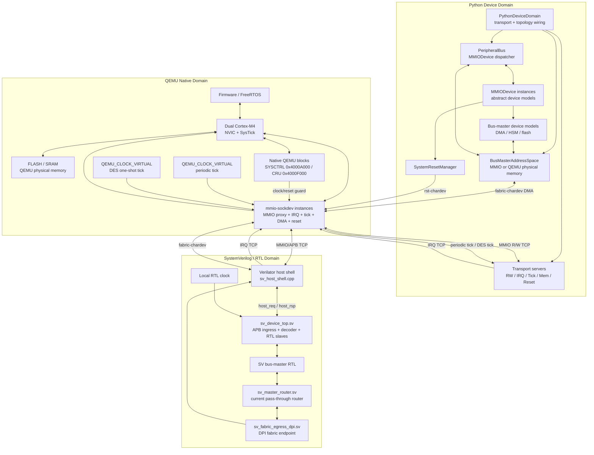

# Architecture Diagram

```mermaid
flowchart TB
    subgraph QEMU["QEMU Native Domain"]
        direction TB

        FW["Firmware / FreeRTOS"]
        CPU["Dual Cortex-M4\nNVIC + SysTick"]
        MEM["FLASH / SRAM\nQEMU physical memory"]
        NATIVE["Native QEMU blocks\nSYSCTRL 0x4000A000 / CRU 0x4000F000"]
        SOCK["mmio-sockdev instances\nMMIO proxy + IRQ + tick + DMA + reset"]
        PTICK["QEMU_CLOCK_VIRTUAL\nperiodic tick"]
        DTICK["QEMU_CLOCK_VIRTUAL\nDES one-shot tick"]

        FW <--> CPU
        CPU <--> MEM
        CPU <--> NATIVE
        CPU <--> SOCK
        NATIVE -->|"clock/reset guard"| SOCK
        PTICK --> SOCK
        DTICK --> SOCK
        SOCK --> CPU
    end

    subgraph PY["Python Device Domain"]
        direction TB

        PYDOM["PythonDeviceDomain\ntransport + topology wiring"]
        PYSRV["Transport servers\nRW / IRQ / Tick / Mem / Reset"]
        PYBUS["PeripheralBus\nMMIODevice dispatcher"]
        PYDEV["MMIODevice instances\nabstract device models"]
        PYADDR["BusMasterAddressSpace\nMMIO or QEMU physical memory"]
        PYDMA["Bus-master device models\nDMA / HSM / flash"]
        PYRST["SystemResetManager"]

        PYDOM --> PYSRV
        PYDOM --> PYBUS
        PYDOM --> PYADDR
        PYBUS <--> PYDEV
        PYDEV --> PYDMA
        PYDMA <--> PYADDR
        PYADDR <--> PYBUS
        PYDEV --> PYRST
    end

    subgraph SV["SystemVerilog / RTL Domain"]
        direction TB

        SVBR["Verilator host shell\nsv_host_shell.cpp"]
        SVTOP["sv_device_top.sv\nAPB ingress + decoder + RTL slaves"]
        SVCLOCK["Local RTL clock"]
        SVROUTER["sv_master_router.sv\ncurrent pass-through router"]
        SVEGRESS["sv_fabric_egress_dpi.sv\nDPI fabric endpoint"]
        SVDMA["SV bus-master RTL"]

        SVBR <-->|"host_req / host_rsp"| SVTOP
        SVCLOCK --> SVTOP
        SVTOP <--> SVDMA
        SVDMA <--> SVROUTER
        SVROUTER <--> SVEGRESS
        SVEGRESS --> SVBR
    end

    SOCK <-->|"MMIO R/W TCP"| PYSRV
    SOCK <-->|"MMIO/APB TCP"| SVBR

    PYSRV -->|"IRQ TCP"| SOCK
    SVBR -->|"IRQ TCP"| SOCK

    SOCK -->|"periodic tick / DES tick"| PYSRV
    PYADDR <-->|"fabric-chardev DMA"| SOCK
    SVBR <-->|"fabric-chardev"| SOCK
    PYRST -->|"rst-chardev"| SOCK
```
